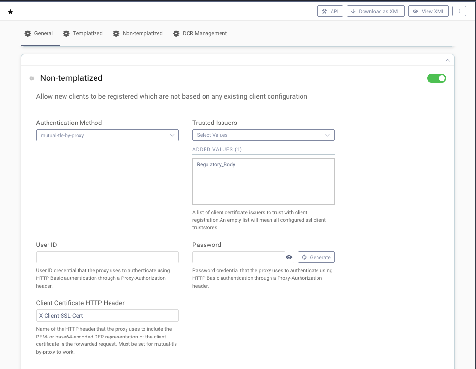

# Request Validation in Gateway

[](https://curity.io/resources/code-examples/status/)
[](https://curity.io/resources/code-examples/status/)

This repository contains the configuration for the Curity Identity Server and nginx to enable Dynamic Client Registration using mTLS. It also shows how to perform a validation of a software statement within nginx. This setup allows to implement compliance with various Open Banking specifications such as the Open Banking Brasil Security Profile.

For more information on Curity and its capabilities, click [here](https://curity.io).

## Installation and Setup

Get a license for the Curity Identity Server from the developer portal at https://developer.curity.io. Copy the license file to `idsvr/license.json`.

Run `docker compose up nginx`. It will setup an admin node of the Curity Identity Server and a runtime node that is secured by a reverse proxy, i.e. nginx.

The system comes with its own PKI, one for securing the infrastructure ("CA") and one for authentication ("Regulatory CA"). In a production system you will use one PKI such as Let's Encrypt for the server certificates and another one for client and user authentication. For example, in case of the Open Banking Brasil Security Profile client certificates and software statements must be issued by Brazil ICP.

Curity Identity Server is configured to allow dynamic client registration requests by any client that can provide a valid client certificate issued by the Regulatory CA. Nginx validates the client requests and among others checks that the request contains a valid software statement signed by the Regulatory CA. Nginx does not validate the signature of the software statement itself but forwards the token to an external service for validation. To test and run this example make sure you also run the [JWT validation service example](https://github.com/curityio/java-jwt-validation) or update the nginx config to point to another JWKS URI.

## Example Request

A client can only register with a valid software statement. To retrieve a software statement for testing refer to the [JWT validation service example](https://github.com/curityio/java-jwt-validation) that includes a mocked service for generating a software statement that works with this implementation.

```shell
curl http://localhost:8080/softwarestatement
```

Copy the token into the DCR request:

```shell
curl --cert certs/testclient.cert.pem --key certs/testclient.key.pem --cacert certs/ca-chain.cert.pem https://localhost/oauth/v2/oauth-dynamic-client-registration -d '{"redirect_uris": ["https://tpp.example.com/"], "scope":"openid", "software_statement":"..."}' -v
```

The following command sends an invalid request. The client must not include `jwks` in the request.

```shell
curl --cert certs/testclient.cert.pem --key certs/testclient.key.pem --cacert certs/ca-chain.cert.pem https://localhost/oauth/v2/oauth-dynamic-client-registration -d '{"jwks":"my-secret-key-data", "redirect_uris": ["https://tpp.example.com/"], "scope":"openid", "software_statement":"..."}' -v
```

## Behind the Scene

### Configure DCR with mTLS

DCR requests using templatized clients are very convenient but they are not suitable for this use case because the configuration does only support client secret authentication for newly created clients which does not comply with common Open Banking requirements. Therefore, enable Dynamic Client Registration for non-templatized clients. The client must use a client certificate signed by a regulatory body when sending the DCR request. However, the request will pass a reverse proxy thus the client authentication method set for DCR must be `mutual-tls-by-proxy` with the CA certificate of the regulatory body such as Brazil ICP. The reverse proxy will use the header `X-Client-SSL-Cert` for forwarding the client certificate to the Curity Identity Server.



### Scripting in nginx

The client's request passes the reverse proxy, i.e. nginx which terminates the TLS sessions in order to validate and adapt the request before sending it to the upstream server aka the Curity Identity Server. As a result nginx handles any mutual TLS session and validates the client's certificate. Only if the certificate is valid, nginx will continue with processing of the request content. To validate the `software_statement` in the DCR request an external service is called. This is because of a limitation in the resty.jwt module regarding signature algorithms. After successful validation nginx will add default values before it forwards the request to the Curity Identity Server together with the client certificate in the header `X-Client-SSL-Cert`.

```
...
# Trusted issuers for client certificates
ssl_client_certificate /tmp/ca-bank-chain.pem;

...
access_by_lua_block {
  ...
  -- Load request data
  ngx.req.read_body()
  local http_body_data = ngx.req.get_body_data()

  -- Call module that handles the request validation and returns updated client metadata
  metadata_valid, return_value = pcall(dcr_request.validate, http_body_data)

  ...

  -- Exit access phase
  if metadata_valid == true then
    -- Update request body
    ngx.req.set_body_data(return_value)
    ngx.log(ngx.DEBUG, "Request Body: " .. return_value)
    ngx.exit(ngx.OK)
  else
    -- Return Error
    ...
  end
}

# Forward request
proxy_set_header Host $host;
proxy_set_header X-Real-IP $remote_addr;
# Add client certificate
proxy_set_header X-Client-SSL-Cert $ssl_client_escaped_cert;
proxy_pass http://internal-curity-runtime:8443;
```

## More Information
Please visit [curity.io](https://curity.io/) for more information about the Curity Identity Server.

Check out the [Open Banking Brazil Status Update and Short-Term Roadmap](https://curity.io/blog/open-banking-brazil-status-update-and-short-term-roadmap/).

Also have a look at how the [Curity Identity Server supports Open Banking Brazil](https://curity.io/open-banking-brazil/)

Copyright (C) 2021 Curity AB.
